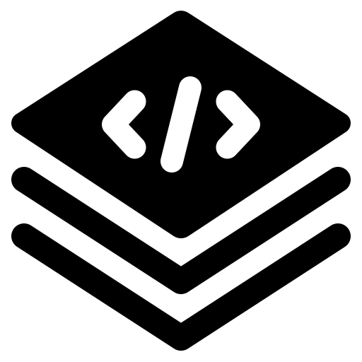

# Manual de Marca — Specsfy

Este arquivo editável é a fonte do PDF do manual de marca. Ele resume o
sistema visual sem substituir os arquivos normativos de `brand/`.

## Fundamento

Specsfy conecta intenção, especificação, implementação e evidência em um fluxo
auditável. A assinatura verbal é:

> Especifique. Comprove. Entregue.

A marca deve parecer precisa, estruturada, pragmática e técnica sem se tornar
fria.

## Símbolo

{width=128px}

As três camadas representam decisões que permanecem conectadas durante a
entrega. O código na camada superior indica que a especificação chega ao
software executável.

### Variantes

- `logo/icon.svg`: ícone principal com placa petróleo;
- `logo/icon-light.svg`: aplicação transparente em fundo claro;
- `logo/icon-dark.svg`: aplicação transparente em fundo escuro;
- `logo/logo-light.svg`: assinatura horizontal para fundo claro;
- `logo/logo-dark.svg`: assinatura horizontal para fundo escuro;
- `logo/icon.png`: fallback raster.

Reserve 12,5% de espaço livre e não use o ícone abaixo de 28 px. Não remova,
separe ou reordene camadas. Gradiente, sombra, filtro, rotação e deformação não
são permitidos.

## Cores

| Papel | Light mode | Dark mode |
| --- | --- | --- |
| Fundo | `#F2F8F9` | `#000A0E` |
| Superfície | `#FFFFFF` | `#001117` |
| Texto | `#00161E` | `#ECFDFB` |
| Texto secundário | `#2D4C58` | `#B2C6CE` |
| Acento | `#6D28D9` | `#C4B5FD` |
| Foco | `#15626A` | `#5EEDE1` |

Petróleo e turquesa identificam a família Promovaweb. Violeta identifica
especificação. Estados usam os tokens semânticos de `colors/palette.json` e
nunca dependem somente da cor.

## Tipografia

- Manrope 500–800: títulos e chamadas;
- Inter 400–700: interface e texto corrido;
- JetBrains Mono: código, comandos, IDs e evidências.

Use corpo de 16/26 px ou maior. As webfontes latinas de Manrope e Inter estão
armazenadas em `fonts/` com suas licenças.

## Interface

O arquivo `global.css` carrega as fontes e define tokens para light e dark
mode. `tailwind-theme.js` oferece a mesma linguagem para Tailwind CSS.
`tokens.json` atende consumidores que não usam CSS.

## Acessibilidade

- contraste mínimo de 4,5:1 para texto normal;
- contraste mínimo de 3:1 para texto grande e componentes;
- foco sempre visível;
- rótulo textual para estados;
- `alt="Logo do Specsfy"` quando o símbolo tiver função informativa.

Os pares calculados estão em `accessibility.md`.

## Governança

Toda alteração deve atualizar a fonte correspondente, este manual e o PDF:

```bash
make brand-guide
```

Antes de publicar, execute o checklist de `checklist.md`.
