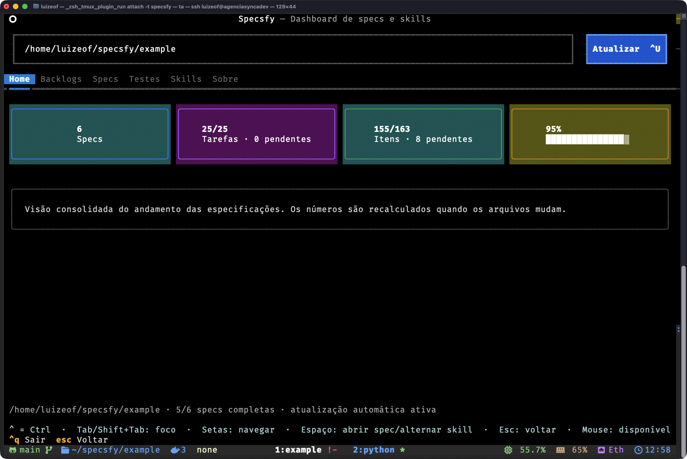
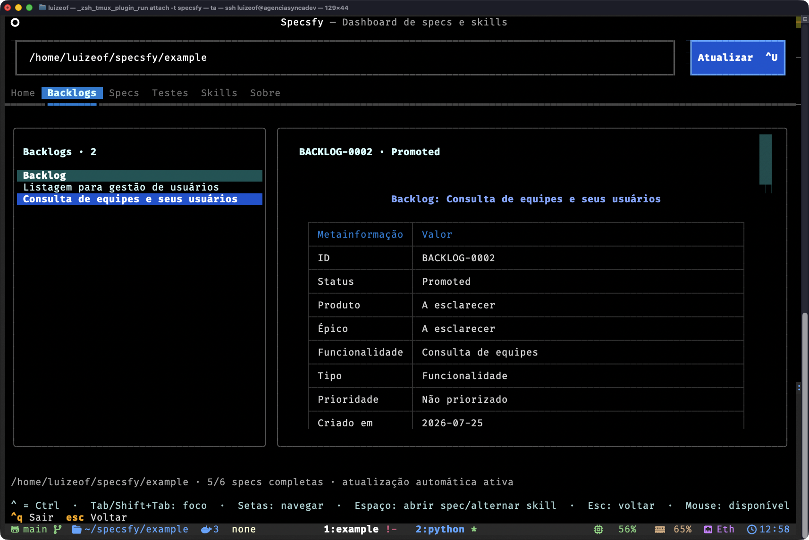
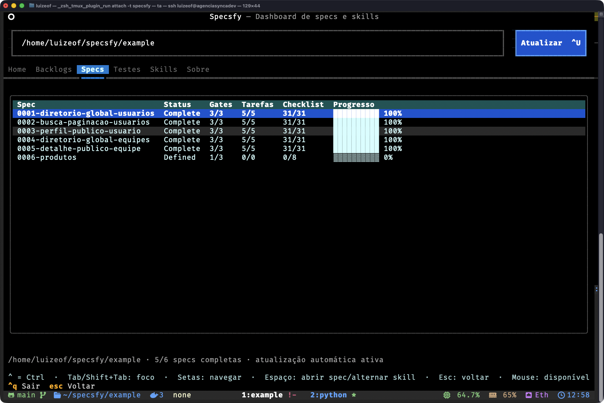
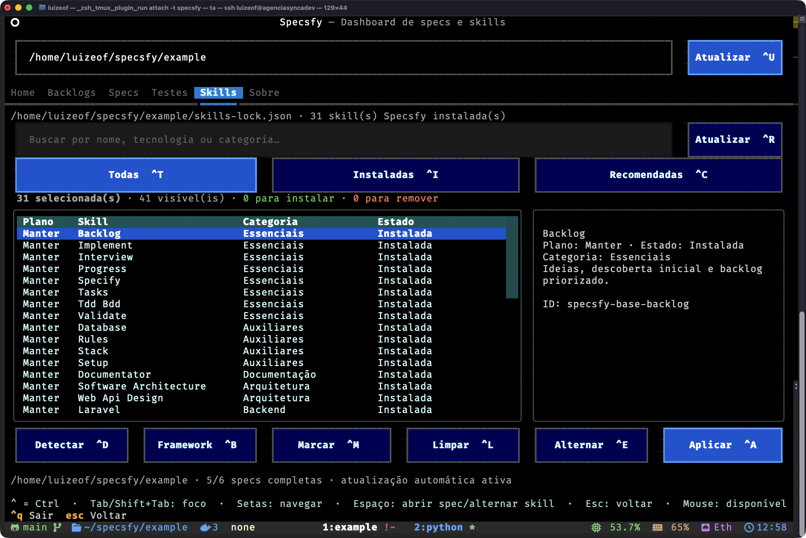

# CLI e TUI do Specsfy

## Classificação

| Campo | Valor |
| --- | --- |
| Natureza | normativo |
| Escopo | automação, atualização e projeção visual do Specsfy |
| Autoridade | interface pública do repositório `cli/` |

## Papel

Explicar como operar e atualizar o executável `specsfy` depois do bootstrap,
sem transformar o workspace de desenvolvimento em projeto consumidor.

## Como usar

Instale primeiro o executável e o framework seguindo o
[guia de instalação](installation.md). Este guia assume que `specsfy --version`
já responde no terminal e que o bootstrap foi executado no projeto consumidor.
Para conduzir a primeira fatia depois do bootstrap, siga o
[guia de uso básico](basic-usage.md). Para seleção técnica, automação e
reabertura de gates, consulte o [uso avançado](advanced-usage.md).

Ao criar uma especificação, `specsfy-base-specify` renderiza o template
instalado em `specs/specs/<NNNN>-<slug>/spec.md`. O arquivo de exemplo demonstra
os três atos e as 18 seções para agentes, testes e diagnóstico do CLI, mas não é
fonte normativa de uma feature. O cabeçalho renderizado é uma tabela Markdown
de duas colunas, `Campo` e `Valor`, com um metadado por linha.

Instale as bases e todos os especialistas detectados em uma única chamada:

```bash
specsfy install --project . --detected
```

Também é possível selecionar especialistas explicitamente. Repita
`--specialist` para compor o conjunto:

```bash
specsfy install --project . \
  --specialist specsfy-specialist-laravel \
  --specialist specsfy-specialist-postgres
```

Para consultar e gerenciar o catálogo separadamente:

```bash
specsfy skills list
specsfy skills detect --project .
specsfy skills add specsfy-specialist-laravel --project .
specsfy skills update --project .
```

## Atualização automática

Ao abrir `specsfy` ou `specsfy tui` em um terminal interativo, o CLI verifica
as tags semânticas estáveis de
[`cli/`](../cli/). O cache e as configurações
globais ficam em `~/.specsfy/cli.json`, com permissão restrita ao usuário e
intervalo padrão de 24 horas entre consultas.

Quando uma tag aponta para uma versão superior, o CLI apresenta a versão atual
e pergunta se deve atualizar. Recusar abre o dashboard normalmente. Aceitar
executa `uv tool upgrade specsfy-cli`, preservando a origem e as opções
registradas pelo `uv` na instalação, e então encerra. A versão nova entra em
uso na próxima abertura.

O arquivo global separa `settings`, incluindo habilitação e intervalo da
consulta, de `cache`, que registra horário, tag, versão, commit, ETag e erro
recente. Chaves desconhecidas são preservadas. Indisponibilidade de rede,
resposta inválida ou falha de escrita não bloqueiam a aplicação; o aviso é
adiado e o fluxo normal continua.

Como o monorepo é privado, catálogo e tags são consultados com `GH_TOKEN`,
`GITHUB_TOKEN` ou, na ausência dessas variáveis, com a sessão de
`gh auth token`. Execute `gh auth login` antes do primeiro uso. O token não é
copiado para `~/.specsfy/cli.json`.

A mesma atualização pode ser iniciada diretamente, sem abrir a TUI:

```bash
uv tool upgrade specsfy-cli
```

## Dashboard e progresso

Execute sem argumentos dentro do projeto consumidor para abrir a TUI:

```bash
specsfy
```

`specsfy tui --project PATH` abre explicitamente outro projeto. O dashboard é
organizado em seis abas:

- **Home**, com as estatísticas consolidadas;
- **Backlogs**, com lista navegável na coluna esquerda e preview Markdown
  formatado na coluna direita;
- **Specs**, com a tabela e o progresso de cada especificação;
- **Testes**, com execução do runner detectado, resumo da última execução e
  saída detalhada em subabas separadas;
- **Skills**, com catálogo tabular, painel de detalhes e uma prévia explícita
  das instalações e remoções pendentes;
- **Sobre**, com a versão e a finalidade do CLI.

O dashboard apresenta:

- quantidade total e concluída de specs;
- tarefas `T...` concluídas, pendentes e totais;
- todos os itens de checklist concluídos, pendentes e totais;
- gates aprovados por spec;
- porcentagem e barra de progresso global;
- porcentagem e barra de progresso de cada spec.

### Percurso visual

#### Home: visão consolidada



A Home reúne o total de specs, o avanço das tarefas e checklists e a
porcentagem global. O diretório selecionado aparece no topo e o rodapé confirma
quantas specs estão completas e se a atualização automática está ativa.

#### Backlogs: lista e leitura lado a lado



A aba Backlogs mantém a seleção na coluna esquerda e renderiza o Markdown do
item na direita. Assim é possível conferir metainformação, status e conteúdo
sem abandonar o dashboard.

#### Specs: gates, tarefas e progresso



A aba Specs compara status, gates, tarefas, checklists e porcentagem por
especificação. A linha destacada pode ser aberta com `Espaço` para consultar a
spec completa em um modal Markdown.

#### Skills: planejar antes de aplicar



A aba Skills combina busca, filtros, plano, categoria e estado com o painel de
detalhes da seleção. Os totais acima da tabela antecipam instalações e remoções;
nada muda no projeto até a ação **Aplicar**.

## Testes do projeto

Em um projeto Laravel com Pest, execute:

```bash
specsfy test --project .
```

O CLI detecta `artisan` e `pestphp/pest`, chama `php artisan test` diretamente
na raiz selecionada, transmite a saída e preserva o exit code do runner. Ele
não aceita uma string de shell arbitrária.

Na aba **Testes**, `Executar testes ^X` inicia a mesma execução. A subaba
**Resumo** mostra resultado, runner, comando, projeto, duração, exit code e os
totais emitidos pelo Pest. A subaba **Testes** mantém a saída completa e
rolável; quando o projeto fornece um relatório Pest estruturado, cada falha é
apresentada com nome do teste, arquivo, linha e mensagem.

O progresso usa todos os checkboxes Markdown de
`specs/specs/*/spec.md`. Tarefas com
ID `T...` também ganham estatística própria. Quando uma spec não possui
checkboxes, os três gates são usados como projeção de fallback.

A TUI calcula fingerprints dos backlogs, das specs e do `skills-lock.json`. Ela
atualiza automaticamente as listas, previews, cards e seleção de skills quando
esses arquivos mudam. O intervalo padrão é 0,75 segundo e pode ser configurado
por projeto:

```bash
specsfy config show --project .
specsfy config set --project . --watch-interval 0.5
```

O rodapé apresenta os atalhos:

- `Ctrl+Q`: sair;
- `Ctrl+U`: atualizar;
- `Ctrl+D`: detectar recomendações;
- `Ctrl+B`: selecionar todas as skills do framework;
- `Ctrl+E`: alternar o plano da skill destacada;
- `Ctrl+M`: marcar os resultados visíveis;
- `Ctrl+L`: limpar os resultados visíveis;
- `Ctrl+A`: aplicar a seleção;
- `Ctrl+R`: atualizar todas as skills Specsfy instaladas;
- `Ctrl+T`, `Ctrl+I`, `Ctrl+C`: abrir os filtros Todas, Instaladas e
  Recomendadas;
- `Ctrl+H`, `Ctrl+G`, `Ctrl+S`, `Ctrl+K`, `Ctrl+O`: abrir Home, Backlogs,
  Specs, Skills e Sobre.
- `Ctrl+J`: abrir Testes;
- `Ctrl+X`: executar os testes do projeto selecionado.

Os atalhos são globais e aparecem nos próprios rótulos dos botões. A interface
inteira também aceita:

- `Tab` e `Shift+Tab` para percorrer controles;
- setas para navegar listas e tabelas;
- `Enter` ou `Espaço` para alternar o plano da skill destacada;
- `Esc` para limpar a busca ou voltar à Home;
- mouse para abas, listas, preview, filtros e botões.

Foco, cursor, seleção e ações primárias usam contraste reforçado para manter
legibilidade em terminais escuros.

Na aba Skills, cada linha separa `Plano`, `Skill`, `Categoria` e `Estado`. O
plano usa os valores `Instalar`, `Manter`, `Remover` e `Ignorar`; ele expressa
o que acontecerá sem executar a mudança imediatamente. O painel lateral mostra
o identificador completo, a descrição, a recomendação e o plano da linha
destacada. A alteração só ocorre ao acionar `Aplicar`.

A configuração vive em `<projeto>/.specsfy/config.json`. Valores desconhecidos
adicionados pelo usuário são preservados quando o CLI atualiza uma opção.

Para automação e integração com outras ferramentas:

```bash
specsfy progress --project .
specsfy progress --project . --json
specsfy progress --project . --watch
specsfy progress --project . --watch --interval 0.5 --json
```

O JSON contém um objeto `summary` e a coleção `specs`. Com `--watch`, um novo
snapshot é emitido somente quando o conteúdo das specs muda. A TUI também
oferece instalação das bases, detecção e instalação de especialistas.

O leitor mantém compatibilidade com `specs/<NNNN>-<slug>/spec.md` para projetos
existentes, mas toda spec nova usa `specs/specs/`. Itens em `specs/backlog/`
não entram na porcentagem de entrega.

## Justificativa de tamanho

Este guia permanece em uma unidade porque comandos equivalentes, atualização,
dashboard, atalhos e segurança formam a mesma interface pública do CLI. A
instalação possui jornada e pré-requisitos próprios em `installation.md`; cada
capacidade operacional permanece em seção própria para leitura localizada.

## Atualize quando

- um comando, argumento, destino ou formato público mudar;
- a TUI ou o mecanismo de atualização mudar;
- o contrato de automação ou progresso mudar.

## Não use para

- instalar no workspace `promovaweb/specsfy`;
- criar specs ou alterar gates;
- documentar a implementação interna do Python;
- executar deploy ou instalar pacotes de aplicação.

## Fonte da verdade e precedência

O comportamento executável vive em
[`cli/`](../cli/). As skills base pertencem a
[`skills/`](../skills/), os especialistas a
[`specialists/`](../specialists/) e cada spec ao
projeto consumidor.

## Segurança e reversibilidade

- O destino padrão é `<projeto>/.agents/skills`.
- As regras centrais ficam em `<projeto>/.specsfy/Spec.md`.
- Template e exemplo ficam em `<projeto>/.specsfy/templates/Spec.md` e
  `<projeto>/.specsfy/examples/Spec.md`.
- `AGENTS.md` e `CLAUDE.md` recebem somente blocos delimitados e atualizáveis.
- O registro fica em `<projeto>/.specsfy/skills-lock.json`.
- Cada skill gerenciada registra um fingerprint de conteúdo no lock.
- Uma execução repetida sobre a mesma versão não altera arquivos nem o lock.
- Uma skill gerenciada e intacta pode receber uma versão nova sem `--force`.
- Alterações locais bloqueiam atualização e remoção; `--force` é a decisão
  explícita para descartá-las.
- Downloads dos catálogos usam checkout temporário; a materialização é delegada
  a `skills add`.
- `specsfy skills remove <nome>` remove somente o nome explícito e preserva
  conteúdo local divergente.
- O CLI recusa a raiz reconhecida do workspace `promovaweb/specsfy`.
