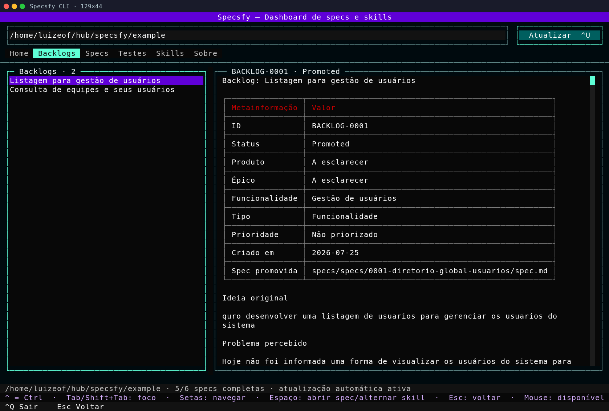
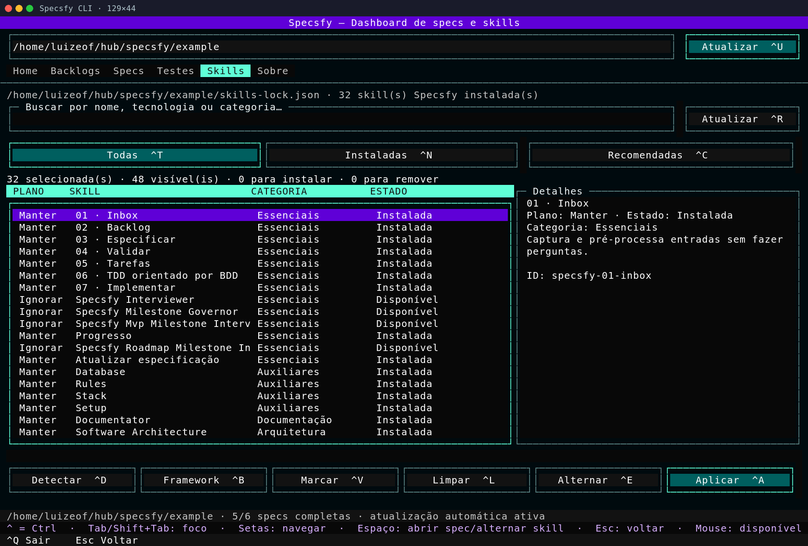

# CLI e TUI do Specsfy

O executável `specsfy` instala e atualiza as skills, mostra o progresso, executa
os testes detectados e abre um dashboard no terminal. Instale primeiro o CLI e
o framework seguindo o
[guia de instalação](installation.md). Este guia assume que `specsfy --version`
já responde no terminal e que o bootstrap foi executado no projeto consumidor.
Para conduzir a primeira fatia depois do bootstrap, siga o
[guia do primeiro projeto](getting-started.md). Para seleção técnica, automação
e reabertura de gates, consulte o [uso avançado](advanced-usage.md).
Para consultar cada argumento, opção, efeito e formato de saída, use a
[referência dos comandos](cli-reference.md).

Os templates de ideia, backlog, spec, tarefas e informações permanentes ficam
em `.specsfy/templates/`. Customizações com o mesmo nome ficam em
`.specsfy/templates/custom/` e têm precedência sobre os arquivos padrão. Ao
criar uma especificação, `specsfy-03-specify` renderiza o template resolvido em
`specs/draft/<NNNN>-<slug>/spec.md`. O exemplo demonstra os três atos e as 18
seções para agentes, testes e diagnóstico do CLI, mas não governa uma feature.
O cabeçalho renderizado é uma tabela Markdown de duas colunas, `Campo` e
`Valor`, com um metadado por linha.

## Instalar e gerenciar skills

Para preparar um projeto novo, o comando `install` pode publicar as bases e
todos os especialistas detectados em uma única execução:

```bash
specsfy doctor --project .
specsfy setup --project . --detected
```

Quando você já souber quais stacks precisam de orientação especializada,
repita `--specialist` para instalar somente o conjunto indicado:

```bash
specsfy install --project . \
  --specialist specsfy-specialist-laravel \
  --specialist specsfy-specialist-postgres
```

Depois da instalação inicial, os subcomandos de `skills` permitem listar o
catálogo, detectar recomendações, adicionar uma skill ou atualizar as versões
gerenciadas:

```bash
specsfy skills list
specsfy skills detect --project .
specsfy skills add specsfy-specialist-laravel --project .
specsfy update --project .
```

## Atualização automática

Ao abrir `specsfy` ou `specsfy tui` em um terminal interativo, o CLI verifica
as tags semânticas estáveis de
[`cli/`](../../cli/). O cache e as configurações
globais ficam em `~/.specsfy/cli.json`, com permissão restrita ao usuário e
intervalo padrão de 24 horas entre consultas.

Quando uma tag aponta para uma versão superior, o CLI apresenta a versão atual
e pergunta se deve atualizar. Recusar abre o dashboard normalmente. Aceitar
executa `npm install --global @promovaweb/specsfy@latest` e encerra o CLI. A
versão nova entra em uso na próxima abertura.

O arquivo global separa `settings`, incluindo habilitação e intervalo da
consulta, de `cache`, que registra horário, tag, versão, commit, ETag e erro
recente. Chaves desconhecidas são preservadas. A aplicação continua abrindo
quando a rede está indisponível, a resposta é inválida ou a escrita falha, e o
aviso fica para a próxima consulta.

Como o monorepo é privado, catálogo e tags são consultados com `GH_TOKEN`,
`GITHUB_TOKEN` ou, na ausência dessas variáveis, com a sessão de
`gh auth token`. O token não é copiado para `~/.specsfy/cli.json`.

Em uma instalação global gerenciada pelo npm, `upgrade` atualiza o próprio
CLI. Abra o comando novamente para conferir a nova versão:

```bash
specsfy upgrade
specsfy --version
```

Não confunda os dois fluxos: `specsfy update --project .` atualiza as skills do
projeto; `specsfy upgrade` atualiza o programa global. O comando anterior
`specsfy skills update` permanece como alias compatível.

Se você instalou o executável Node com `curl -fL get.specsfy.dev`, repita o
download descrito no [guia de instalação](installation.md). Nesse caso, a
oferta automática exige o npm disponível. Uma falha preserva a versão atual e
abre a TUI normalmente.

## Dashboard e progresso

## Ciclo de vida de specs

O CLI move specs pelo ciclo `draft`, `defined`, `planned`, `in-progress`,
`review` e `completed`. Ele atualiza o campo `Status` junto com a pasta:

```bash
specsfy transition 0001-recuperar-senha defined --project .
specsfy transition 0001-recuperar-senha planned --project .
specsfy transition 0001-recuperar-senha in-progress --project .
specsfy migrate --project .
```

Use `migrate` apenas para converter o layout anterior `specs/specs/`. Para
recalibrar a execução, registre Effort e sua justificativa diretamente na fonte
normativa:

```bash
specsfy effort 0001-recuperar-senha 7 \
  --reason "Inclui migração e integração externa." --project .
```

Execute sem argumentos dentro do projeto consumidor para abrir a TUI:

```bash
specsfy
```

`specsfy tui --project PATH` abre explicitamente outro projeto. O dashboard é
organizado em seis abas:

- **Home**, com as estatísticas consolidadas.
- **Backlogs**, com lista navegável na coluna esquerda e preview Markdown
  formatado na coluna direita.
- **Specs**, com a tabela e o progresso de cada especificação.
- **Testes**, com execução do runner detectado, resumo da última execução e
  saída detalhada em subabas separadas.
- **Skills**, com catálogo tabular, painel de detalhes e uma prévia explícita
  das instalações e remoções pendentes.
- **Sobre**, com a versão e a finalidade do CLI.

No dashboard, os cards e as tabelas combinam estes dados para mostrar tanto o
estado global quanto a situação de cada spec:

- quantidade total e concluída de specs.
- tarefas `T...` concluídas, pendentes e totais.
- todos os itens de checklist concluídos, pendentes e totais.
- gates aprovados por spec.
- porcentagem e barra de progresso global.
- porcentagem e barra de progresso de cada spec.

### Percurso visual

#### Home: visão consolidada


A Home reúne o total de specs, o avanço das tarefas e checklists e a
porcentagem global. O diretório selecionado aparece no topo e o rodapé confirma
quantas specs estão completas e se a atualização automática está ativa.

#### Backlogs: lista e leitura lado a lado



A aba Backlogs mantém a seleção na coluna esquerda e renderiza o Markdown do
item na direita. Assim é possível conferir metainformação, status e conteúdo
sem abandonar o dashboard.

#### Specs: gates, tarefas e progresso


A aba Specs compara status, gates, tarefas, checklists e porcentagem por
especificação. A linha destacada pode ser aberta com `Espaço` para consultar a
spec completa em um modal Markdown.

#### Skills: planejar antes de aplicar



A aba Skills combina busca, filtros, plano, categoria e estado com o painel de
detalhes da seleção. Os totais acima da tabela mostram instalações e remoções
planejadas. Nada muda no projeto até a ação **Aplicar**.

## Testes do projeto

Em um projeto Laravel com Pest, `specsfy test` detecta o runner e transmite a
saída do teste no mesmo terminal:

```bash
specsfy test --project .
```

O CLI detecta `artisan` e `pestphp/pest`, chama `php artisan test` diretamente
na raiz selecionada, transmite a saída e preserva o exit code do runner. Ele
não aceita uma string de shell arbitrária.

Na aba **Testes**, `Executar testes ^X` inicia a mesma execução. A subaba
**Resumo** mostra resultado, runner, comando, projeto, duração, exit code e os
totais emitidos pelo Pest. A subaba **Testes** mantém a saída completa e
rolável. Quando o projeto fornece um relatório Pest estruturado, cada falha é
apresentada com nome do teste, arquivo, linha e mensagem.

O progresso usa todos os checkboxes Markdown de
`specs/<estado>/*/spec.md`. Tarefas com
ID `T...` também ganham estatística própria. Quando uma spec não possui
checkboxes, os três gates são usados como projeção de fallback.

A TUI calcula fingerprints dos backlogs, das specs e do `skills-lock.json`. Ela
atualiza automaticamente as listas, previews, cards e seleção de skills quando
esses arquivos mudam. O intervalo padrão é 0,75 segundo e pode ser configurado
por projeto:

```bash
specsfy config show --project .
specsfy config set --project . --watch-interval 0.5
```

O rodapé apresenta os atalhos disponíveis na aba atual. Use essas combinações
para trocar de tela ou aplicar uma ação sem retirar o foco do terminal:

- `Ctrl+Q`: sair.
- `Ctrl+U`: atualizar.
- `Ctrl+D`: detectar recomendações.
- `Ctrl+B`: selecionar todas as skills do framework.
- `Ctrl+E`: alternar o plano da skill destacada.
- `Ctrl+V`: marcar os resultados visíveis.
- `Ctrl+L`: limpar os resultados visíveis.
- `Ctrl+A`: aplicar a seleção.
- `Ctrl+R`: atualizar todas as skills Specsfy instaladas.
- `Ctrl+T`, `Ctrl+N`, `Ctrl+C`: abrir os filtros Todas, Instaladas e
  Recomendadas.
- `Ctrl+H`, `Ctrl+G`, `Ctrl+S`, `Ctrl+K`, `Ctrl+O`: abrir Home, Backlogs,
  Specs, Skills e Sobre.
- `Ctrl+J`: abrir Testes.
- `Ctrl+X`: executar os testes do projeto selecionado.

Os atalhos são globais e aparecem nos próprios rótulos dos botões. A interface
inteira também aceita:

- `Tab` e `Shift+Tab` para percorrer controles.
- setas para navegar listas e tabelas.
- `Enter` ou `Espaço` para alternar o plano da skill destacada.
- `Esc` para fechar o modal da spec, limpar a busca ou voltar à Home.
- mouse para abas, listas, preview, filtros e botões.

O campo de projeto entra em edição com `Enter` ou com um clique. A confirmação
recarrega backlogs, specs e skills a partir do caminho informado.

A TUI usa a paleta escura oficial do Specsfy. O turquesa identifica o foco e a
aba ativa, o violeta marca a linha selecionada e as ações primárias usam fundo
petróleo com texto claro. Cada estado também mantém um rótulo visível, por isso
continua compreensível quando a paleta configurada no terminal altera as cores.

Na aba Skills, cada linha separa `Plano`, `Skill`, `Categoria` e `Estado`. O
plano usa os valores `Instalar`, `Manter`, `Remover` e `Ignorar`. Ele expressa
o que acontecerá sem executar a mudança imediatamente. O painel lateral mostra
o identificador completo, a descrição, a recomendação e o plano da linha
destacada. A alteração só ocorre ao acionar `Aplicar`.

A configuração vive em `<projeto>/.specsfy/config.json`. Valores desconhecidos
adicionados pelo usuário são preservados quando o CLI atualiza uma opção.

Para automação, `specsfy progress` pode emitir texto, JSON ou uma sequência de
snapshots. Assim, outro processo recebe uma nova leitura somente quando o
conteúdo das specs muda:

```bash
specsfy progress --project .
specsfy progress --project . --json
specsfy progress --project . --watch
specsfy progress --project . --watch --interval 0.5 --json
```

O JSON contém um objeto `summary` e a coleção `specs`. Com `--watch`, um novo
snapshot é emitido somente quando o conteúdo das specs muda, o que evita
leituras repetidas em uma integração. A instalação das bases e dos
especialistas continua disponível na TUI e nos comandos de `skills`.

O leitor mantém compatibilidade com `specs/<NNNN>-<slug>/spec.md` para projetos
existentes, mas toda spec nova usa `specs/draft/`. Itens em `specs/backlog/`
não entram na porcentagem de entrega.

## Justificativa de tamanho

Comandos, dashboard e atalhos operam os mesmos arquivos do projeto. Reuni-los
nesta página permite comparar a ação no terminal com o resultado mostrado na
TUI, sem duplicar explicações sobre progresso e proteção de alterações locais.

## Segurança e reversibilidade

- O destino padrão é `<projeto>/.agents/skills`.
- As regras centrais ficam em `<projeto>/.specsfy/Spec.md`.
- Template e exemplo ficam em `<projeto>/.specsfy/templates/Spec.md` e
  `<projeto>/.specsfy/examples/Spec.md`.
- Templates personalizados ficam em
  `<projeto>/.specsfy/templates/custom/`, fora do lock e protegidos até mesmo
  de operações com `--force`.
- `AGENTS.md` e `CLAUDE.md` recebem somente blocos delimitados e atualizáveis.
- O registro fica em `<projeto>/.specsfy/skills-lock.json`.
- Cada skill gerenciada registra um fingerprint de conteúdo no lock.
- Uma execução repetida sobre a mesma versão não altera arquivos nem o lock.
- Uma skill gerenciada e intacta pode receber uma versão nova sem `--force`.
- Alterações locais fazem a atualização e a remoção serem recusadas. Use
  `--force` somente depois de confirmar que a versão customizada pode ser
  descartada.
- Downloads dos catálogos usam checkout temporário, e `skills add` faz a
  instalação no projeto.
- `specsfy skills remove <nome>` remove somente o nome explícito e preserva
  conteúdo local divergente.
- O CLI recusa a raiz reconhecida do workspace `promovaweb/specsfy`.
