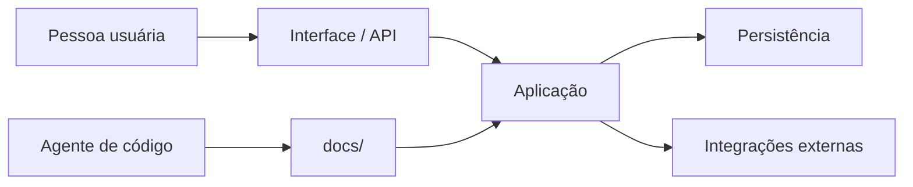

# Arquitetura

<!-- specsfy:documentator:start -->
## Contexto arquitetural

- Frameworks e superfícies observadas: Laravel, Pest, React, Tailwind CSS.
- A topologia abaixo é inferida de manifests e caminhos; confirme limites não
  expressos no código.

## UML de componentes implementados

## Evidência por camada

| Camada | Quantidade | Exemplos |
| --- | --- | --- |
| Controllers | 38 | `app/Http/Controllers/Controller.php`, `app/Http/Controllers/DashboardController.php`, `app/Http/Controllers/Directory/TeamDirectoryController.php`, `app/Http/Controllers/Directory/UserDirectoryController.php`, `app/Http/Controllers/Settings/ProfileController.php` |
| Models | 4 | `app/Models/Membership.php`, `app/Models/Team.php`, `app/Models/TeamInvitation.php`, `app/Models/User.php` |
| Services | 0 | — |
| Jobs | 0 | — |
| Policies | 1 | `app/Policies/TeamPolicy.php` |
| Routes and APIs | 3 | `routes/console.php`, `routes/settings.php`, `routes/web.php` |
| Views | 1 | `resources/views/app.blade.php` |
| Pages | 18 | `resources/js/layouts/settings/layout.tsx`, `resources/js/pages/auth/confirm-password.tsx`, `resources/js/pages/auth/forgot-password.tsx`, `resources/js/pages/auth/login.tsx`, `resources/js/pages/auth/register.tsx` |
| Components | 62 | `resources/js/components/alert-error.tsx`, `resources/js/components/app-content.tsx`, `resources/js/components/app-header.tsx`, `resources/js/components/app-logo-icon.tsx`, `resources/js/components/app-logo.tsx` |
| Tests | 30 | `tests/Feature/Auth/AuthenticationTest.php`, `tests/Feature/Auth/PasswordConfirmationTest.php`, `tests/Feature/Auth/PasswordResetTest.php`, `tests/Feature/Auth/RegistrationTest.php`, `tests/Feature/Auth/TwoFactorChallengeTest.php` |
| Other source | 122 | `app/Actions/Fortify/CreateNewUser.php`, `app/Actions/Fortify/ResetUserPassword.php`, `app/Actions/Teams/CreateTeam.php`, `app/Concerns/GeneratesUniqueTeamSlugs.php`, `app/Concerns/HasTeams.php` |
<!-- specsfy:documentator:end -->
