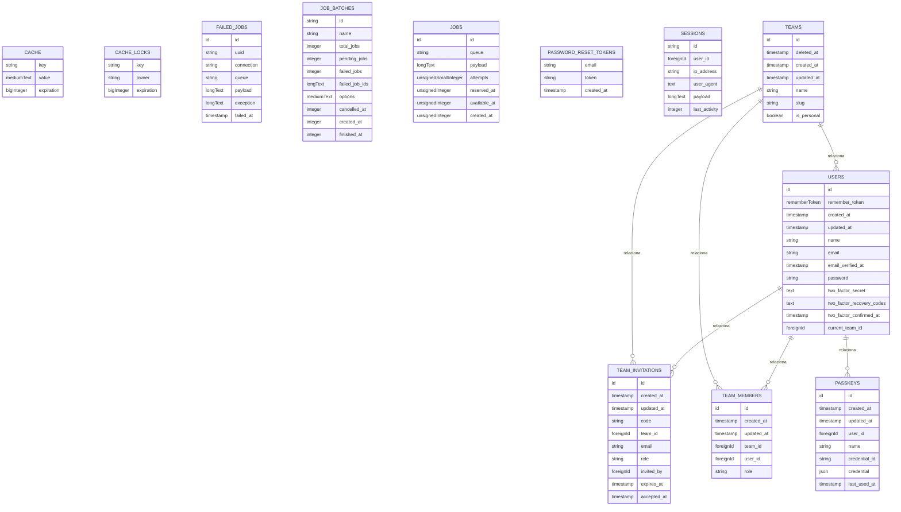

# Banco de dados

<!-- specsfy:documentator:start -->
## Mapa de persistência

| Entidade/Tabela | Campos | Relações | Fonte |
| --- | --- | --- | --- |
| cache | key:string, value:mediumText, expiration:bigInteger | não inferidas | `database/migrations/0001_01_01_000001_create_cache_table.php` |
| cache_locks | key:string, owner:string, expiration:bigInteger | não inferidas | `database/migrations/0001_01_01_000001_create_cache_table.php` |
| failed_jobs | id:id, uuid:string, connection:string, queue:string, payload:longText, exception:longText, failed_at:timestamp | não inferidas | `database/migrations/0001_01_01_000002_create_jobs_table.php` |
| job_batches | id:string, name:string, total_jobs:integer, pending_jobs:integer, failed_jobs:integer, failed_job_ids:longText, options:mediumText, cancelled_at:integer, created_at:integer, finished_at:integer | não inferidas | `database/migrations/0001_01_01_000002_create_jobs_table.php` |
| jobs | id:id, queue:string, payload:longText, attempts:unsignedSmallInteger, reserved_at:unsignedInteger, available_at:unsignedInteger, created_at:unsignedInteger | não inferidas | `database/migrations/0001_01_01_000002_create_jobs_table.php` |
| passkeys | id:id, created_at:timestamp, updated_at:timestamp, user_id:foreignId, name:string, credential_id:string, credential:json, last_used_at:timestamp | users | `database/migrations/2024_01_01_000000_create_passkeys_table.php` |
| password_reset_tokens | email:string, token:string, created_at:timestamp | não inferidas | `database/migrations/0001_01_01_000000_create_users_table.php` |
| sessions | id:string, user_id:foreignId, ip_address:string, user_agent:text, payload:longText, last_activity:integer | não inferidas | `database/migrations/0001_01_01_000000_create_users_table.php` |
| team_invitations | id:id, created_at:timestamp, updated_at:timestamp, code:string, team_id:foreignId, email:string, role:string, invited_by:foreignId, expires_at:timestamp, accepted_at:timestamp | teams, users | `database/migrations/2026_01_27_000001_create_teams_table.php` |
| team_members | id:id, created_at:timestamp, updated_at:timestamp, team_id:foreignId, user_id:foreignId, role:string | teams, users | `database/migrations/2026_01_27_000001_create_teams_table.php` |
| teams | id:id, deleted_at:timestamp, created_at:timestamp, updated_at:timestamp, name:string, slug:string, is_personal:boolean | não inferidas | `database/migrations/2026_01_27_000001_create_teams_table.php` |
| users | id:id, remember_token:rememberToken, created_at:timestamp, updated_at:timestamp, name:string, email:string, email_verified_at:timestamp, password:string, two_factor_secret:text, two_factor_recovery_codes:text, two_factor_confirmed_at:timestamp, current_team_id:foreignId | teams | `database/migrations/0001_01_01_000000_create_users_table.php; database/migrations/2025_08_14_170933_add_two_factor_columns_to_users_table.php; database/migrations/2026_01_27_000002_add_current_team_id_to_users_table.php` |

## Fonte complementar

Consulte [`.specsfy/DATABASE.md`](../.specsfy/DATABASE.md) para decisões,
ownership, retenção e detalhes humanos não inferíveis.
<!-- specsfy:documentator:end -->
