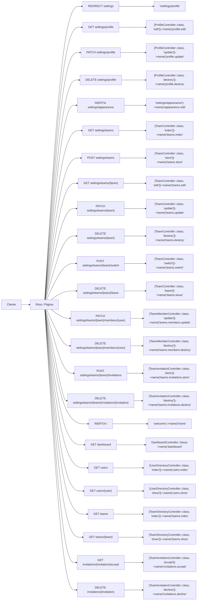
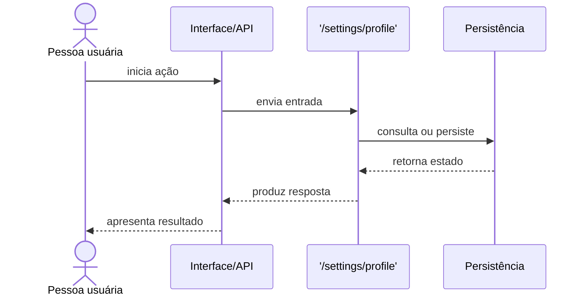

# Fluxos

<!-- specsfy:documentator:start -->
## Entradas observadas

| Método/Tipo | Caminho | Destino observado |
| --- | --- | --- |
| REDIRECT | settings | '/settings/profile' |
| GET | settings/profile | [ProfileController::class, 'edit'])->name('profile.edit' |
| PATCH | settings/profile | [ProfileController::class, 'update'])->name('profile.update' |
| DELETE | settings/profile | [ProfileController::class, 'destroy'])->name('profile.destroy' |
| INERTIA | settings/appearance | 'settings/appearance')->name('appearance.edit' |
| GET | settings/teams | [TeamController::class, 'index'])->name('teams.index' |
| POST | settings/teams | [TeamController::class, 'store'])->name('teams.store' |
| GET | settings/teams/{team} | [TeamController::class, 'edit'])->name('teams.edit' |
| PATCH | settings/teams/{team} | [TeamController::class, 'update'])->name('teams.update' |
| DELETE | settings/teams/{team} | [TeamController::class, 'destroy'])->name('teams.destroy' |
| POST | settings/teams/{team}/switch | [TeamController::class, 'switch'])->name('teams.switch' |
| DELETE | settings/teams/{team}/leave | [TeamController::class, 'leave'])->name('teams.leave' |
| PATCH | settings/teams/{team}/members/{user} | [TeamMemberController::class, 'update'])->name('teams.members.update' |
| DELETE | settings/teams/{team}/members/{user} | [TeamMemberController::class, 'destroy'])->name('teams.members.destroy' |
| POST | settings/teams/{team}/invitations | [TeamInvitationController::class, 'store'])->name('teams.invitations.store' |
| DELETE | settings/teams/{team}/invitations/{invitation} | [TeamInvitationController::class, 'destroy'])->name('teams.invitations.destroy' |
| INERTIA | / | 'welcome')->name('home' |
| GET | dashboard | DashboardController::class)->name('dashboard' |
| GET | users | [UserDirectoryController::class, 'index'])->name('users.index' |
| GET | users/{user} | [UserDirectoryController::class, 'show'])->name('users.show' |
| GET | teams | [TeamDirectoryController::class, 'index'])->name('teams.index' |
| GET | teams/{team} | [TeamDirectoryController::class, 'show'])->name('teams.show' |
| GET | invitations/{invitation}/accept | [TeamInvitationController::class, 'accept'])->name('invitations.accept' |
| DELETE | invitations/{invitation} | [TeamInvitationController::class, 'decline'])->name('invitations.decline' |

## Fluxo de navegação e requisição

## Sequência representativa

<!-- specsfy:documentator:end -->
