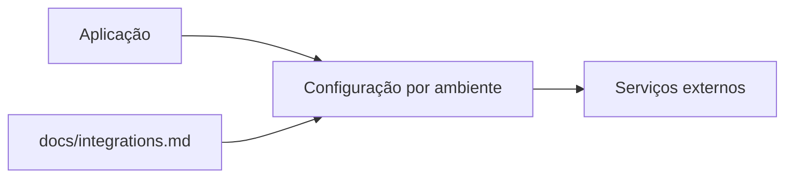

# Integrações

<!-- specsfy:documentator:start -->
## Integrações observadas

| Sinal | Tipo | Fonte segura |
| --- | --- | --- |
| APP_DEBUG | variável de ambiente | `.env.example` (somente nome) |
| APP_ENV | variável de ambiente | `.env.example` (somente nome) |
| APP_FAKER_LOCALE | variável de ambiente | `.env.example` (somente nome) |
| APP_FALLBACK_LOCALE | variável de ambiente | `.env.example` (somente nome) |
| APP_KEY | variável de ambiente | `.env.example` (somente nome) |
| APP_LOCALE | variável de ambiente | `.env.example` (somente nome) |
| APP_MAINTENANCE_DRIVER | variável de ambiente | `.env.example` (somente nome) |
| APP_NAME | variável de ambiente | `.env.example` (somente nome) |
| APP_URL | variável de ambiente | `.env.example` (somente nome) |
| AWS_ACCESS_KEY_ID | variável de ambiente | `.env.example` (somente nome) |
| AWS_BUCKET | variável de ambiente | `.env.example` (somente nome) |
| AWS_DEFAULT_REGION | variável de ambiente | `.env.example` (somente nome) |
| AWS_SECRET_ACCESS_KEY | variável de ambiente | `.env.example` (somente nome) |
| AWS_USE_PATH_STYLE_ENDPOINT | variável de ambiente | `.env.example` (somente nome) |
| BCRYPT_ROUNDS | variável de ambiente | `.env.example` (somente nome) |
| BROADCAST_CONNECTION | variável de ambiente | `.env.example` (somente nome) |
| CACHE_STORE | variável de ambiente | `.env.example` (somente nome) |
| DB_CONNECTION | variável de ambiente | `.env.example` (somente nome) |
| FILESYSTEM_DISK | variável de ambiente | `.env.example` (somente nome) |
| LOG_CHANNEL | variável de ambiente | `.env.example` (somente nome) |
| LOG_DEPRECATIONS_CHANNEL | variável de ambiente | `.env.example` (somente nome) |
| LOG_LEVEL | variável de ambiente | `.env.example` (somente nome) |
| LOG_STACK | variável de ambiente | `.env.example` (somente nome) |
| MAIL_FROM_ADDRESS | variável de ambiente | `.env.example` (somente nome) |
| MAIL_FROM_NAME | variável de ambiente | `.env.example` (somente nome) |
| MAIL_HOST | variável de ambiente | `.env.example` (somente nome) |
| MAIL_MAILER | variável de ambiente | `.env.example` (somente nome) |
| MAIL_PASSWORD | variável de ambiente | `.env.example` (somente nome) |
| MAIL_PORT | variável de ambiente | `.env.example` (somente nome) |
| MAIL_SCHEME | variável de ambiente | `.env.example` (somente nome) |
| MAIL_USERNAME | variável de ambiente | `.env.example` (somente nome) |
| MEMCACHED_HOST | variável de ambiente | `.env.example` (somente nome) |
| QUEUE_CONNECTION | variável de ambiente | `.env.example` (somente nome) |
| REDIS_CLIENT | variável de ambiente | `.env.example` (somente nome) |
| REDIS_HOST | variável de ambiente | `.env.example` (somente nome) |
| REDIS_PASSWORD | variável de ambiente | `.env.example` (somente nome) |
| REDIS_PORT | variável de ambiente | `.env.example` (somente nome) |
| SESSION_DOMAIN | variável de ambiente | `.env.example` (somente nome) |
| SESSION_DRIVER | variável de ambiente | `.env.example` (somente nome) |
| SESSION_ENCRYPT | variável de ambiente | `.env.example` (somente nome) |
| SESSION_LIFETIME | variável de ambiente | `.env.example` (somente nome) |
| SESSION_PATH | variável de ambiente | `.env.example` (somente nome) |
| VITE_APP_NAME | variável de ambiente | `.env.example` (somente nome) |

## Mapa

Valores de ambiente, credenciais e endpoints privados não são publicados.
Confirme autenticação, timeout, retry e ownership quando não estiverem
expressos no código.
<!-- specsfy:documentator:end -->
